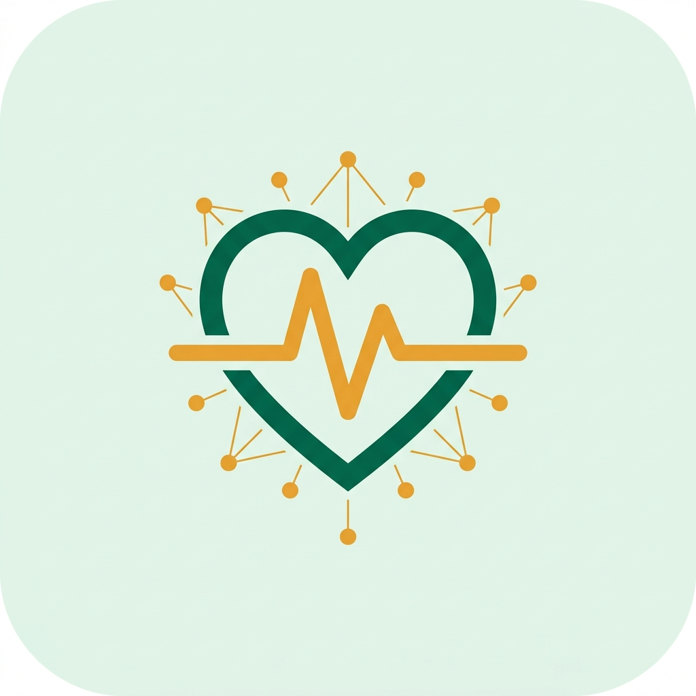

<div align="center">



<h1>CommunityPulse</h1>

**Real-time community action platform — connecting volunteers to critical local needs.**

[](https://reactnative.dev/)
[](https://expo.dev/)
[](https://firebase.google.com/)
[](https://docs.expo.dev/build/introduction/)
[](LICENSE)

[📲 Download APK](#download) · [📖 Documentation](#documentation) · [🚀 Get Started](#get-started)

</div>

---

## 🌍 Problem Statement

Community needs — food emergencies, medical gaps, shelter crises — go unanswered not because volunteers don't care, but because **there's no fast, reliable bridge** between those who see a problem and those who can solve it.

Traditional WhatsApp groups and spreadsheets are slow, noisy, and untracked. There is no urgency ranking, no task ownership, no impact accountability.

---

## 💡 Solution — CommunityPulse

CommunityPulse is a **production-grade, real-time mobile platform** that transforms community reports into structured, prioritized, trackable tasks for on-the-ground volunteers.

> **Built for the Google Solution Challenge** — addressing UN SDG #1 (No Poverty), #3 (Good Health), and #11 (Sustainable Communities).

---

## ✨ Core Features

### 🚨 Field Reporting Engine
Any community member can instantly submit a need with category, urgency level, and location — directly from their phone. Reports are automatically attributed to the reporter and routed to the right volunteers.

### 🎯 Intelligent Task Board
A dynamic, filterable task board surfaces the most critical needs first. Every task has a real-time **urgency score (0–100)**, animated progress bars, and color-coded severity chips: `CRITICAL` · `HIGH` · `MEDIUM` · `LOW`.

### 🔒 Atomic Multi-User Collaboration
Built to handle **concurrent multi-user access** without data races:
- Uses **Firestore atomic transactions** — if two volunteers tap "Accept" simultaneously, only one succeeds; the other sees a graceful "In Progress" state.
- 4-state task lifecycle: `Available` → `In Progress (mine)` → `In Progress (theirs)` → `Completed`

### 📊 Live Impact Dashboard
Every volunteer's **HomeScreen** shows real-time stats — Tasks Done, Active Tasks, Impact Score — updated atomically via Firestore `increment()` operations. No stale data, no manual refreshes.

### 🔔 Activity Feed
A live chronological feed shows exactly what's happening across the community — task completions, new reports, and volunteer activity — keeping the entire team aligned.

---

## 🛠️ Tech Stack

| Layer | Technology |
|---|---|
| **Frontend** | React Native 0.76 · Expo SDK 53 |
| **Animations** | React Native Reanimated (springs, stagger, layout) |
| **Navigation** | React Navigation 6 (Stack + Custom Tab Bar) |
| **Backend / DB** | Firebase Firestore (real-time listeners, transactions) |
| **Auth** | Firebase Auth (Email/Password + Google OAuth) |
| **Build** | EAS Build (Expo Application Services) |

---

## 🏗️ Architecture

```
src/
├── screens/          # UI layer — all 8 screens
│   ├── HomeScreen.js       # Live stats dashboard + urgent task banner
│   ├── TasksScreen.js      # Filterable task board with animated cards
│   ├── TaskDetailScreen.js # Multi-state task lifecycle UI
│   ├── ReportScreen.js     # Field reporting form
│   ├── ProfileScreen.js    # User profile + impact history
│   ├── LoginScreen.js      # Auth entry point
│   └── SignupScreen.js     # Role-based registration
│
├── services/
│   └── firestoreService.js # All Firestore logic: transactions, increments,
│                           # real-time subscriptions, activity logging
│
├── context/
│   ├── AppContext.js       # Global real-time data: needs, activity feed
│   └── AuthContext.js      # Auth state + user profile management
│
├── navigation/
│   └── AppNavigator.js     # Auth-gated navigation (Auth vs App stacks)
│
├── components/
│   ├── Icons.js            # 30+ custom SVG icons (zero external deps)
│   └── CustomTabBar.js     # Animated bottom navigation bar
│
├── hooks/
│   └── useGoogleAuth.js    # Google Sign-In flow
│
└── theme/
    └── colors.js           # Design tokens: colors, typography, shadows
```

### Core Data Flow

```
Field Report Submitted
    ↓
firestoreService.submitReport()
    ↓  (writes to Firestore `needs` collection)
AppContext real-time listener fires on ALL connected clients
    ↓
Task appears instantly on every volunteer's TasksScreen
    ↓
Volunteer accepts → runTransaction() → atomic ownership claim
    ↓
Volunteer completes → completeTask() → increment(tasksDone, impactScore)
    ↓
HomeScreen stats update live for that user
```

---

## 📲 Download

> **Live APK available via Expo EAS Build:**
>
> 🔗 [Download for Android](https://expo.dev/accounts/pranavagarkar07/projects/NexCoder/builds/a8c6e43c-63e8-4ef7-a74a-24969d63465f)

---

## 🚀 Get Started

### Prerequisites
- [Node.js 18+](https://nodejs.org/)
- [Expo CLI](https://docs.expo.dev/get-started/installation/)
- A [Firebase project](https://console.firebase.google.com/) with Firestore + Authentication enabled

### 1. Clone
```bash
git clone https://github.com/PranavAgarkar07/CommunityPulse.git
cd CommunityPulse
```

### 2. Install Dependencies
```bash
npm install
```

### 3. Configure Firebase
1. In your Firebase Console → Project Settings → Android App
2. Download `google-services.json`
3. Place it in the project root (`CommunityPulse/`)

### 4. Run Locally
```bash
npx expo start
```
Scan the QR code with **Expo Go** (Android/iOS) to launch instantly.

### 5. Build APK
```bash
npm install -g eas-cli
eas login
eas build -p android --profile preview
```

---

## 🎨 Design System

| Token | Value |
|---|---|
| Primary | `#00694C` — Deep Emerald |
| Secondary | `#1960A6` — Ocean Blue |
| Accent | `#EF9F27` — Harvest Amber |
| Background | `#EEF5EF` — Mint Mist |
| Surface | `#FFFFFF` |
| Critical | `#D32F2F` |

**Typography:** System-native (Roboto on Android, SF Pro on iOS)  
**Icons:** 30+ custom inline SVG — zero icon-library dependencies  
**Animations:** `Animated` (Stagger, Spring, Timing) + safe-area aware layouts

---

## 🤝 Contributing

Contributions, issues, and feature requests are welcome!

1. Fork the repository
2. Create a feature branch: `git checkout -b feat/amazing-feature`
3. Commit your changes: `git commit -m 'feat: add amazing feature'`
4. Push to the branch: `git push origin feat/amazing-feature`
5. Open a Pull Request

---

## 📄 License

Distributed under the MIT License. See `LICENSE` for more information.

---

<div align="center">

**Built with ❤️ for communities.**

*CommunityPulse — Google Solution Challenge 2025*

</div>
